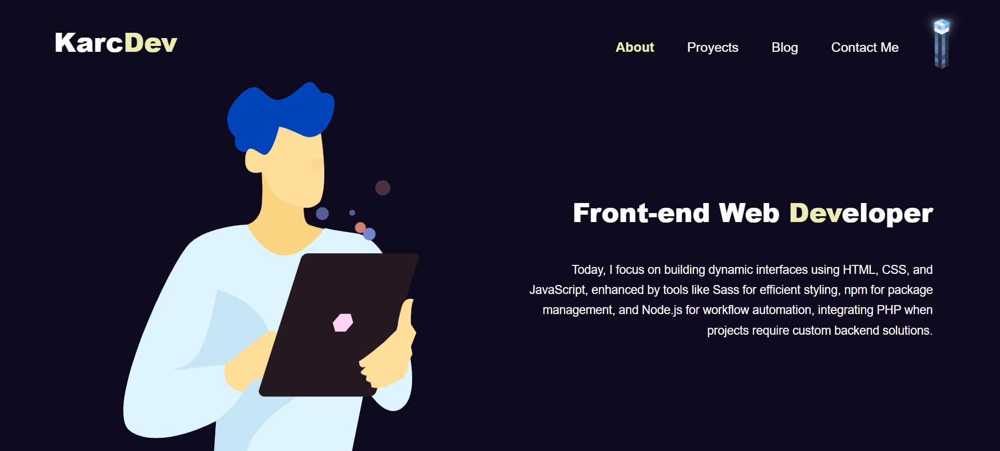
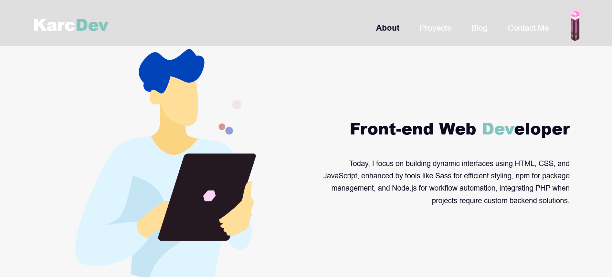

# 💼 Karc Dev Portfolio

This is the personal portfolio website of **Karc Dev**, designed to showcase real and personal web development projects. It serves as a professional platform to attract clients, demonstrate coding skills, and establish an online presence.

🔗 **Live site:** [karc-dev-portfolio.netlify.app](https://karc-dev-portfolio.netlify.app)

---

## ✨ Features

- 🌗 Dark/Light mode support
- 🌀 Smooth GSAP animations
- 📱 Responsive design for all devices
- 📩 Functional contact form (via Formspree)
- 📦 Project showcase with external live links
- ⚙️ Built with modular SCSS and Gulp automation

---

## 🛠️ Built With

- **HTML5**
- **SCSS (SASS)**
- **JavaScript (Vanilla)**
- **GSAP (GreenSock)**
- **Gulp**
- **NPM** for dependency management

---

## 📁 Getting Started

### Prerequisites

Make sure you have `Node.js` and `npm` installed.

### Clone this repo

```bash
git clone https://github.com/tu-usuario/karc-dev-portfolio.git
cd karc-dev-portfolio
Install dependencies
npm install

Run Gulp (development server)
gulp

Build for production
gulp build

📷 Preview




📬 Contact
If you'd like to collaborate or just connect:

📧 karcwork@gmail.com

🌐 karc-dev-portfolio.netlify.app

🔖 License
This project is personal and not licensed for redistribution or commercial use without permission.